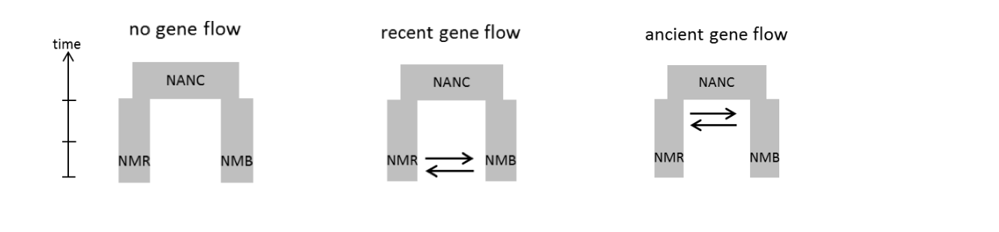

```{r, fig.height = 7, fig.width = 7, fig.align = "center", message = FALSE, warning = FALSE}

## loading packages

library(adegenet)
library(ade4)
library(boot)
library(blme)
library(car)
library(canadamaps)
library(data.table)
library(dartRverse)
library(ecodist)
library(GenomicRanges)
library(hierfstat)
library(kableExtra)
library(knitr)
library(LEA)
library(leaflet)
library(lfmm)
library(lme4)
library(maps)
library(mapplots)
library(mapproj)
library(rnaturalearth)
library(pegas)
library(poppr)
library(prettymapr)
library(qqman)
library(qvalue)
library(reshape2)
library(sf)
library(scales)
library(SeqArray)
library(SeqVarTools)
library(shape)
library(SNPRelate)
library(stringr)
library(tigris)
library(OutFLANK)
library(vcfR)
library(xtable)

```

Almost 25 years of research by the Skelly lab indicate that wood frog populations at Yale-Myers forest exhibit drastic variation in phenotypic traits.  Such variation could derive from a combination of local adaptation, parental effects, and plasticity. In contrast to such remarkable variation, our knowledge on the genetic variation among populations has lagged behind. This is one of the few studies that examines the population genetics of the wood frog at Yale-Myers, and provides a quantitative comparison between genetic differentiation and phenotypic differentiation to determine selection signatures.


```{r, fig.height = 7, fig.width = 7, fig.align = "center", message = FALSE, warning = FALSE}

## loading project

load("/Users/dpadil10/ASU Dropbox/Dylan Padilla/Yale/YMF2018/data/aRanSyl_genind_chr_pos.RData")
metadata <- read.csv("/Users/dpadil10/ASU Dropbox/Dylan Padilla/Yale/YMF2018/data/YMF2018_RASYpopgen_sampleinfo.csv", row.names = 1)
##load("/gpfs/gibbs/project/skelly/dp996/YMF2018/data/aRanSyl_gl_chr_pos.RData")

aRanSyl_rows <- rownames(aRanSyl_genind$tab)
##aRanSyl_rows
aRanSyl_rows[-203] <- gsub(paste0("_S", ".*"), "", aRanSyl_rows[-203])
aRanSyl_rows[203] <- "YNL_SCP2016_325"
aRanSyl_rows <- data.frame(match.col = aRanSyl_rows)

metadata$match.col <- paste(metadata$Pop, metadata$Extract, sep = "_")
metadata$match.col[260:263] <- paste("YNL_", metadata$match.col[260:263], sep = "")
metadata$match.col[3:48] <- gsub("(_)(.)", "\\10\\2", metadata$match.col[3:48])
##metadata$match.col

## cleaning 'meta' to ensure exactly one record per 'match.col'
## this prevents the row count from expanding if meta has duplicate IDs
meta_unique <- metadata[!duplicated(metadata$match.col), ]
##meta_unique$match.col

## perform a left join
## 'all.x = TRUE' ensures we keep all 205 rows from aRanSyl_rows
#merged.tab <- merge(aRanSyl_rows, meta_unique, by = "match.col", all.x = TRUE)
merged.tab <- merge(aRanSyl_rows, meta_unique, by = "match.col", all.x = FALSE)
##str(merged.tab)
##merged.tab
#write.csv(merged.tab, file = "/Users/dpadil10/ASU Dropbox/Dylan Padilla/Yale/YMF2018/data/YMF2018_metadata_Mar-20-26.csv", row.names = FALSE)

## I have to remove the second and third sample of the genind object
## because I cannot find them in the metadata
ind.rm <- c("YMF2018_026_S23_R1_001", "YMF2018_035_S47_R1_001")
aRanSyl_genind_pruned <- indNames(aRanSyl_genind)[!indNames(aRanSyl_genind) %in% ind.rm]
##aRanSyl_genind_pruned

aRanSyl_genind <- aRanSyl_genind[aRanSyl_genind_pruned, ]
##aRanSyl_genind


```

Here is the data we have after quality control:


```{r, fig.height = 7, fig.width = 7, fig.align = "center", message = FALSE, warning = FALSE}

## Converting genlight object to geno object

##gl2geno(aRanSyl_gl, outfile = "aRanSyl_geno",
##outpath = "/gpfs/gibbs/project/skelly/dp996/YMF2018/data/", verbose = NULL)


## Run snmf algorithm

##snmf1 <- snmf("/gpfs/gibbs/project/skelly/dp996/YMF2018/data/aRanSyl_geno.geno",
##             K = 1:10, # number of K ancestral populations to run
##             repetitions = 50, # 50 repetitions for each K
##             entropy = TRUE, # calculate cross-entropy
##             project = "new")

snmf1 <- load.snmfProject("/Users/dpadil10/ASU Dropbox/Dylan Padilla/Yale/YMF2018/data/aRanSyl_geno.snmfProject")


## extract the cross-entropy of all runs where K = 1

ce <- cross.entropy(snmf1, K = 1)
ce2 <- cross.entropy(snmf1, K = 2)
##ce

## find the run with the lowest cross-entropy

lowest.ce <- which.min(ce)
lowest.ce2 <- which.min(ce2)
##lowest.ce

## extract Q-matrix for the best run

qmatrix <- as.data.frame(Q(snmf1, K = 1, run = lowest.ce))
qmatrix2 <- as.data.frame(Q(snmf1, K = 2, run = lowest.ce2))
##head(qmatrix)

## because I removed samples 2 and 3 from the genind object,
## I have to remove rows 2 and 3 of the qmatrix
qmatrix <- qmatrix[-c(2, 3), ]
qmatrix2 <- qmatrix2[-c(2, 3), ]
##qmatrix

aRanSyl_genind$pop <- as.factor(merged.tab$Pond)
##summary(aRanSyl_genind$pop)
##aRanSyl_genind$pop

## some of the ponds contain less than 5 individuals.
## I am only keeping ponds with >= 5 individuals

tab <- data.frame(ind = summary(aRanSyl_genind$pop))
tab$pop <- rownames(tab)
tab.pruned <- tab[tab$ind >= 5, ]

aRanSyl_genind_pops <- popsub(aRanSyl_genind, sublist = tab.pruned$pop)
##aRanSyl_genind_pops

## the number of alleles per locus seems to range from 1 to 2
## we have to work with only biallelic loci, so there should always be 2

n <- names(which(nAll(aRanSyl_genind_pops) == 2))
aRanSyl_genind_pops <- aRanSyl_genind_pops[loc = n]
aRanSyl_genind_pops
##rownames(aRanSyl_genind_pops$tab)

ind.rm2 <- data.frame(match.col = gsub(paste0("_S", ".*"), "",
                                       rownames(aRanSyl_genind_pops$tab)))
merged.tab2 <- merge(merged.tab, ind.rm2, by = "match.col")
##cbind(merged.tab2$match.col, rownames(aRanSyl_genind_pops$tab))
##str(merged.tab2)

##save(aRanSyl_genind_pops,
##     file = "/Users/dpadil10/ASU Dropbox/Dylan Padilla/Yale/YMF2018/data/aRanSyl_genind_pos_pops.Rdata")


## because I ended up removing more individuals from the dataset,
## now I have to make sure I remove the same individuals from the
## qmatrix table.  Practically, I do not have to do this because
## in this particular case, every individual has exactly the same
## genetic ancestry.  But it is still a good practice to remove
## the right individuals from the qmatrix table.  This is because
## if there were a strong population structure, the individuals
## you remove from the qmatrix (i.e., each row) DO MATTER!

tab.rm1 <- data.frame(ind = rownames(aRanSyl_genind$tab),
                      qmatrix = qmatrix)
tab.rm1.1 <- data.frame(ind = rownames(aRanSyl_genind$tab),
                      qmatrix = qmatrix2)

tab.rm2 <- data.frame(ind = rownames(aRanSyl_genind_pops$tab),
                      pop = aRanSyl_genind_pops$pop)
tab.rm2.1 <- data.frame(ind = rownames(aRanSyl_genind_pops$tab),
                      pop = aRanSyl_genind_pops$pop)

## the merging below guarantees that I am removing the correct
## individuals from the qmatrix
tab2 <- merge(tab.rm2, tab.rm1, by = "ind")
tab2.1 <- merge(tab.rm2.1, tab.rm1.1, by = "ind")
##str(tab2)
##str(tab2.1)
qmplot <- tab2
qmplot2 <- tab2.1
qmplot$pop <- as.character(qmplot$pop)
qmplot2$pop <- as.character(qmplot2$pop)
##str(qmplot)
##str(qmplot2)
qmplot <- qmplot[order(qmplot$pop), ]
qmplot2 <- qmplot2[order(qmplot2$pop), ]
##aggregate(qmplot$ind, list(qmplot$pop), length)


```
First, we want to quantify whether there is population structure across ponds.  To do this, I ran an admixture analysis with the LEA package in R.

According to the results, there is no population structure as suggested by the value that minimizes the cross-entropy ($k=1$; see figure below).

```{r, fig.height = 7, fig.width = 7, fig.align = "center", message = FALSE, warning = FALSE}


## plotting entropy to determine K


par(mgp = c(3.2, 1, 0))
plot(snmf1, col = "black", cex = 1.5, pch = 19, las = 1)
Arrows(x = 1, y = 0.490, x1 = 1, y1 = 0.495, col = "black",
       arr.type = "triangle", code = 1, lwd = 1.5, arr.length = 0.2)


```

Also, I estimated pairwise $F_{st}$ values to determine the genetic differentiation among populations. The results suggest relatively low levels of genetic differentiation as shown below.

```{r, fig.height = 7, fig.width = 7, fig.align = "center", message = FALSE, warning = FALSE}

## computing pairwise Fst test

##aRanSyl_fst <- genet.dist(aRanSyl_genind_pops, method = "WC84") %>% round(digits = 3)
## saving here just in case the commands below fail
##save(aRanSyl_fst,
##     file = "/Users/dpadil10/ASU Dropbox/Dylan Padilla/Yale/YMF2018/data/aRanSyl_fst.RData")


## plotting admixture proportions and genetic differentiation

layout(matrix(c(1, 1, 1, 1, 1, 1,
                1, 1, 1, 1, 1, 1,
                2, 2, 2, 2, 2, 2,
                2, 2, 2, 2, 2, 2), ncol = 6, nrow = 4, byrow = TRUE))


barplot(t(qmplot[3]), col = "gray", border = "white", space = 0,
        xlab = "", xaxt = "n",  ylab = "Admixture proportion",
        las = 1, cex.lab = 1.4)

## adding population labels to the axis:

medians <- c()

for(i in 1:length(qmplot$pop)){
    
    axis(1, at = median(which(qmplot$pop == qmplot$pop[i])), labels = "")
    medians <- c(medians, median(which(qmplot$pop == qmplot$pop[i])))
}

names <- unique(qmplot$pop)

obj <- tapply(qmplot$ind, qmplot$pop, length)
obj

segments(x0 = 0, y0 = 0.01,
         x1 = 0, y1 = 1, lty = 2, lwd = 2)

for(i in 1:length(obj)){
    sum <- sum(obj[1:i])
    ##print(sum)
    segments(x0 = sum, y0 = 0.01,
             x1 = sum, y1 = 1, lty = 2, lwd = 2)
}

text(x = as.numeric(unique(as.character(medians))), y = par("usr")[3] - 0.06,
     labels = unique(qmplot$pop), xpd = NA, srt = 35, cex = 0.5, adj = 1)

mtext("Pond", side = 1, line = 2)

load("/Users/dpadil10/ASU Dropbox/Dylan Padilla/Yale/YMF2018/data/aRanSyl_fst.RData")
aRanSyl_fst_mat <- as.matrix(aRanSyl_fst)
aRanSyl_fst_mat[aRanSyl_fst_mat < 0] <- 0
##aRanSyl_fst_mat[1:4, 1:4]


## creating heatmap to plot genetic differentiation between
## populations

get_lower_tri<-function(cor_matrix){
  cor_matrix[lower.tri(cor_matrix, diag = TRUE)]
  return(cor_matrix)
}

lower_tri_matrix <- aRanSyl_fst_mat[lower.tri(round(aRanSyl_fst_mat, 2),
                                              diag = TRUE)]
my_palette <- colorRampPalette(c("lightblue", "red"))(n = 100)

## create matrix

fst_matrix <- matrix(NA, nrow = 19, ncol = 19)
fst_matrix[lower.tri(fst_matrix, diag = TRUE)] <- round(lower_tri_matrix, 2)
labs <- colnames(aRanSyl_fst_mat)

par(mar = c(5, 5, 2, 2))

## creating the image
## we transform the matrix so it looks like the table (Row 1 at top)
## t() transposes it, and we reverse the columns to flip the y-axis

grid_data <- t(fst_matrix[nrow(fst_matrix):1, ])

## generate the heatmap colors

my_colors <- colorRampPalette(c("#8ccddb", "#bf6c6c", "red"))(100)

image(
  1:19, 1:19,           # X and Y coordinates
  grid_data,          # The data
  axes = FALSE,       # Turn off default axes (we will draw our own)
  col = my_colors,    # Colors
  xlab = "", ylab = ""
)

axis(2, at = 1:19, labels = rev(labs), las = 2,
     tick = FALSE, cex.axis = 0.6)
axis(1, at = 1:19, labels = labs, las = 2, tick = FALSE,
     cex.axis = 0.6, las = 1)

## we loop through the original matrix to place the numbers

n <- 19
for (row in 1:n) {
  for (col in 1:n) {
    val <- fst_matrix[row, col]
    
    if (!is.na(val)) {
      # Logic: 
      # x coordinate = column index
      # y coordinate = n + 1 - row index (because y=1 is the bottom)
      text(x = col, y = n + 1 - row, labels = val, col = "black", cex = 0.6)
    }
  }
}

## legend settings

leg_x <- 15.5       # X starting position
leg_y <- 15.0       # Y starting position (bottom of legend)
leg_w <- 0.5       # Width of the bar
leg_h <- 2.5       # Height of the bar
num_cols <- length(my_colors)

## draw the gradient Bar
## we stack tiny rectangles on top of each other

for (i in 1:num_cols) {
  y_start <- leg_y + (i - 1) * (leg_h / num_cols)
  y_end   <- leg_y + (i) * (leg_h / num_cols)
  rect(
    xleft = leg_x, 
    ybottom = y_start, 
    xright = leg_x + leg_w, 
    ytop = y_end, 
    col = my_colors[i], 
    border = NA
  )
}

## add a black border around the legend bar

rect(leg_x, leg_y, leg_x + leg_w, leg_y + leg_h, border = "black")

## add Legend Text Labels (0, 0.5, 1.0)
## we map the data range (0 to 0.83) to the legend height

min_val <- 0
max_val <- max(fst_matrix, na.rm=TRUE) # approx 0.83

## label position 1 (Bottom)

text(x = leg_x + leg_w + 0.2, y = leg_y, labels = min_val,
     adj = 0, cex = 0.8)

## label position 2 (Middle)

text(x = leg_x + leg_w + 0.2, y = leg_y + (leg_h / 2),
     labels = round((max_val/2), 2), adj = 0, cex = 0.8)

## label position 3 (Top)

text(x = leg_x + leg_w + 0.2, y = leg_y + leg_h,
     labels = max_val, adj = 0, cex = 0.8)

## add Title above legend

text(x = leg_x + (leg_w/2), y = leg_y + leg_h + 1,
     labels = expression(italic(F[st])), font = 2, cex = 1)


```


```{r, fig.height = 7, fig.width = 7, fig.align = "center", message = FALSE, warning = FALSE, echo = FALSE, include = FALSE}


## this is what would happen if we select K = 2 in the strcuture analysis

layout(matrix(c(1, 1, 1, 1, 1, 1,
                1, 1, 1, 1, 1, 1,
                2, 2, 2, 2, 2, 2,
                2, 2, 2, 2, 2, 2), ncol = 6, nrow = 4, byrow = TRUE))


barplot(t(qmplot2[3:4]), col = c("gray", "brown"), border = "white", space = 0,
        xlab = "", xaxt = "n",  ylab = "Admixture proportion",
        las = 1, cex.lab = 1.4)

## adding population labels to the axis:

medians <- c()

for(i in 1:length(qmplot2$pop)){
    
    axis(1, at = median(which(qmplot2$pop == qmplot2$pop[i])), labels = "")
    medians <- c(medians, median(which(qmplot2$pop == qmplot2$pop[i])))
}

names <- unique(qmplot2$pop)

obj <- tapply(qmplot2$ind, qmplot2$pop, length)
obj

segments(x0 = 0, y0 = 0.01,
         x1 = 0, y1 = 1, lty = 2, lwd = 2)

for(i in 1:length(obj)){
    sum <- sum(obj[1:i])
    ##print(sum)
    segments(x0 = sum, y0 = 0.01,
             x1 = sum, y1 = 1, lty = 2, lwd = 2,
             col = "blue")
}

text(x = as.numeric(unique(as.character(medians))), y = par("usr")[3] - 0.06,
     labels = unique(qmplot2$pop), xpd = NA, srt = 35, cex = 0.5, adj = 1)

mtext("Pond", side = 1, line = 2)

load("/Users/dpadil10/ASU Dropbox/Dylan Padilla/Yale/YMF2018/data/aRanSyl_fst.RData")
aRanSyl_fst_mat <- as.matrix(aRanSyl_fst)
aRanSyl_fst_mat[aRanSyl_fst_mat < 0] <- 0
aRanSyl_fst_mat[1:4, 1:4]

## creating heatmap to plot genetic differentiation between
## populations

get_lower_tri<-function(cor_matrix){
  cor_matrix[lower.tri(cor_matrix, diag = TRUE)]
  return(cor_matrix)
}

lower_tri_matrix <- aRanSyl_fst_mat[lower.tri(round(aRanSyl_fst_mat, 2),
                                              diag = TRUE)]
my_palette <- colorRampPalette(c("lightblue", "red"))(n = 100)

## create matrix

fst_matrix <- matrix(NA, nrow = 19, ncol = 19)
fst_matrix[lower.tri(fst_matrix, diag = TRUE)] <- round(lower_tri_matrix, 2)
labs <- colnames(aRanSyl_fst_mat)

par(mar = c(5, 5, 2, 2))

## creating the image
## we transform the matrix so it looks like the table (Row 1 at top)
## t() transposes it, and we reverse the columns to flip the y-axis

grid_data <- t(fst_matrix[nrow(fst_matrix):1, ])

## generate the heatmap colors

my_colors <- colorRampPalette(c("#8ccddb", "#bf6c6c", "red"))(100)

image(
  1:19, 1:19,           # X and Y coordinates
  grid_data,          # The data
  axes = FALSE,       # Turn off default axes (we will draw our own)
  col = my_colors,    # Colors
  xlab = "", ylab = ""
)

axis(2, at = 1:19, labels = rev(labs), las = 2,
     tick = FALSE, cex.axis = 0.6)
axis(1, at = 1:19, labels = labs, las = 2, tick = FALSE,
     cex.axis = 0.6, las = 1)

## we loop through the original matrix to place the numbers

n <- 19
for (row in 1:n) {
  for (col in 1:n) {
    val <- fst_matrix[row, col]
    
    if (!is.na(val)) {
      # Logic: 
      # x coordinate = column index
      # y coordinate = n + 1 - row index (because y=1 is the bottom)
      text(x = col, y = n + 1 - row, labels = val, col = "black", cex = 0.6)
    }
  }
}

## legend settings

leg_x <- 15.5       # X starting position
leg_y <- 15.0       # Y starting position (bottom of legend)
leg_w <- 0.5       # Width of the bar
leg_h <- 2.5       # Height of the bar
num_cols <- length(my_colors)

## draw the gradient Bar
## we stack tiny rectangles on top of each other

for (i in 1:num_cols) {
  y_start <- leg_y + (i - 1) * (leg_h / num_cols)
  y_end   <- leg_y + (i) * (leg_h / num_cols)
  rect(
    xleft = leg_x, 
    ybottom = y_start, 
    xright = leg_x + leg_w, 
    ytop = y_end, 
    col = my_colors[i], 
    border = NA
  )
}

## add a black border around the legend bar

rect(leg_x, leg_y, leg_x + leg_w, leg_y + leg_h, border = "black")

## add Legend Text Labels (0, 0.5, 1.0)
## we map the data range (0 to 0.83) to the legend height

min_val <- 0
max_val <- max(fst_matrix, na.rm=TRUE) # approx 0.83

## label position 1 (Bottom)

text(x = leg_x + leg_w + 0.2, y = leg_y, labels = min_val,
     adj = 0, cex = 0.8)

## label position 2 (Middle)

text(x = leg_x + leg_w + 0.2, y = leg_y + (leg_h / 2),
     labels = round((max_val/2), 2), adj = 0, cex = 0.8)

## label position 3 (Top)

text(x = leg_x + leg_w + 0.2, y = leg_y + leg_h,
     labels = max_val, adj = 0, cex = 0.8)

## add Title above legend

text(x = leg_x + (leg_w/2), y = leg_y + leg_h + 1,
     labels = expression(italic(F[st])), font = 2, cex = 1)


```

Based on the results described above, we now know that there seems to be low genetic differentiation between populations (0-0.03), no population structure, and similar heterozygosity.  By contrast, extensive work from the Skelly Lab reveales that there is an effect of global site factor (GSF) and water temperature on development, thermal traits, life-history traits across populations of the wood frog. Sometimes such effects are observed in common garden experiments, rather than in the wild. One puzzling pattern is that individuals from shaded wetlands develop and grow faster than those from warmer environments, potentially compensating for shorter growing seasons (countergradient variation).

Now, here are the things that we do not know and could address moving forward:

- **How populations have remained genetically similar in spite of strong phenotypic variation?**

Dr Skelly and I propose two potential scenarios that may explain this pattern.  First, the populations of Yale Myers might have *recently* diverged from an ancestor and it has not been long enough since the split for genetic drift, recombination, mutation, and selection to produce higher levels of genetic differentiation between populations.  Second, not only have the populations recently split, but also, there might be a considerably high gene flow among populations, which might hinder the power of selection.

These ideas reflect two potential demographic scenarios that we can simulate based on the observed data (See figure below).



These are simple cases involving only two populations, but the same principles apply for a case involving 5 populations, which is the case of our study.  The two scenarios described above are represented in the cartoon by the model of "no gene flow" and the model of "recent gene flow".  I added a third model of "ancient split and gene flow" to test what would happen.

I fitted the models with fastsimcoal2 as indicated below:

### Model of recent split with no gene flow

```{bash}

#| echo: true
#| output: true

cat "/Users/dpadil10/ASU Dropbox/Dylan Padilla/Yale/YMF2018/SFS/fastsimcoal/aRanSyl_RecentSplit/aRanSyl_RecentSplit.tpl"


```


### Model of recent split with gene flow

```{bash}

#| echo: true
#| output: true

cat "/Users/dpadil10/ASU Dropbox/Dylan Padilla/Yale/YMF2018/SFS/fastsimcoal/aRanSyl_Combined/aRanSyl_Combined.tpl"

```


### Model of ancient split with gene flow

```{bash}

#| echo: true
#| output: true

cat "/Users/dpadil10/ASU Dropbox/Dylan Padilla/Yale/YMF2018/SFS/fastsimcoal/aRanSyl_AncientFlow/aRanSyl_AncientFlow.tpl"

```
<br><br><br>

--------------------------------------

I ran fastsimcoal 50 times, selected the run with the best parameter estimates, and calculated the AIC of the model (see below).  The results suggested the a model of recent split with no gene flow was strongly supported by the data as shown below:


### Model comparison beased on AIC

```{r}

aic.table <- read.table("/Users/dpadil10/ASU Dropbox/Dylan Padilla/Yale/YMF2018/SFS/fastsimcoal/AIC_model_table.txt", header = TRUE, sep = "")
aic.table <- aic.table[-c(2, 4), ]
rownames(aic.table) <- c("Ancient gene flow", "Recent gene flow", "No gene flow")
aic.table$deltaL <- as.numeric(aic.table$deltaL)
aic.table$AIC <- as.numeric(aic.table$AIC)
kable(aic.table, digits = 2, format = "html") %>%
  kable_styling(bootstrap_options = "striped")

```

## Here is a plot of the results


```{r, fig.height = 7, fig.width = 7, fig.align = "center", message = FALSE, warning = FALSE}

####### Plotting results of the demographic model ##########

## loading the data
best_lh <- read.table(
    file = "/Users/dpadil10/ASU Dropbox/Dylan Padilla/Yale/YMF2018/SFS/fastsimcoal/aRanSyl_RecentSplit/fsc-selection/bestrun/aRanSyl_RecentSplit.bestlhoods", header = TRUE)

## extracting parameters for plotting 
n_pops <- 5
pop_sizes <- as.numeric(best_lh[1, 1:n_pops])
n_anc <- best_lh$NANC
t_div <- best_lh$TDIV
pop_labels <- colnames(best_lh)[1:n_pops] # Extracts NPOP0, NPOP1, etc.
new_labels <- c("BS", "DT", "E8", "PB", "X7")
pop_labels <- new_labels


## scaling for Spacing
## we want the widest branch to occupy only 60% of the horizontal space between centers
## to ensure there is always a visible gap (space) between populations.
max_val <- max(c(pop_sizes, n_anc))
scale_factor <- max_val / 0.6 

widths <- pop_sizes / scale_factor
n_anc_width <- n_anc / scale_factor

## setup Plot Area
## increase bottom margin (first value in 'mar') to make room for rotated labels
par(mar = c(7, 5, 4, 2)) 

plot(1, type = "n", 
     xlim = c(0.5, n_pops + 0.5), 
     ylim = c(-t_div * 0.1, t_div * 1.9), 
     xlab = "", ylab = "Time (Generations)",
     xaxt = "n", bty = "n", las = 1)

##  drawing Lineages and add Ne at tips
for(i in 1:n_pops){
  w <- widths[i] / 2
  # Draw the branch
  polygon(c(i - w, i + w, i + w, i - w), 
          c(0, 0, t_div, t_div), 
          col = "tan", border = "chocolate4")
    text(i, t_div * 0.05, labels = round(pop_sizes[i], 0), 
       cex = 0.6, font = 2, col = "chocolate4")
  text(i, t_div*0.05+3, labels = rep(expression(italic(N[e])), 5), 
       cex = 0.6, font = 2, col = "chocolate4")
}

## drawing ancestral trunk
trunk_center <- (1 + n_pops) / 2
aw <- n_anc_width / 2
polygon(c(trunk_center - aw, trunk_center + aw, trunk_center + aw, trunk_center - aw),
        c(t_div, t_div, t_div * 1.5, t_div * 1.5),
        col = "tan", border = "chocolate4")
NANC <- "1119"
text(trunk_center, t_div+5, NANC, font = 2, cex = 0.6, col = "chocolate4")
text(trunk_center, t_div+8, expression(italic("N"[e])), font = 2, cex = 0.6,
                                        col = "chocolate4")

## drawing phylogenetic merge lines
for(i in 1:n_pops){
  segments(i, t_div, trunk_center, t_div, col = "chocolate4", lwd = 1.5)
}

## adding final labels
## divergence time label
text(trunk_center-0.6, t_div, paste("TDIV:", round(t_div, 0)),
     pos = 3, font = 2, col = "darkred", cex = 0.8)

## x-axis labels for clarity
text(x = 1:n_pops+0.1, y = -t_div * 0.08, labels = pop_labels, 
     adj = 1, xpd = TRUE, cex = 1)


```

-------------------------------------------------

Based on the results of the model, we can estimate how long it would take for the populations to reach some levels of genetic differentiation in the absence of selection and migration.  We can do that by estimating pairwise $F_{st}$ between DT and E8.  I picked those two populations because we want to control for population size (you can see that they are about the same size).

I estimated the time for populations to reach $F_{st}>0.09$.  Although, this threshold might seem arbitrary, previous personal observations across the range of the species suggest that populations can be highly differentiated with $F_{st}=0.8$. However, a previous work on the population genetics of the wood frog in an altered forested wetland ecosystem found a max $F_{st}=0.05$ ([Skibbe *et. al.*, (2021)](https://www.herpconbio.org/Volume_16/Issue_1/Skibbe_etal_2021.pdf)), and they considered that value as a significant level of genetic differentiation.

To estimate the time ($t$) required to reach those levels of genetic differentiation ($F_{st}=0.05$ and $F_{st}>0.09$), I simulated a $10~Mb$ region of the genome, with a mutation rate of $1.3\times10^{-9}$, and a baseline recombination rate of $1\times10^{-8}$. I ran the simulation in SLIM as indicated below:

```{bash}

#| echo: true
#| output: true

cat "/Users/dpadil10/ASU Dropbox/Dylan Padilla/Yale/YMF2018/scripts/slim/slim-sim.slim"

```

The results of the simulation indicate that for two populations of about the same size (DT and E8), the $t$ required for *genetic drift*, but not *selection*, to reach at least $F_{st}=0.05$ is about $250$ generations ago.  According to the most likely demographic scenario, the populations of Yale-Myers Forest split $62$ generations, which is not long enough for us to observe significant genetic differentiation.  Note that this is just what would happen between populations in the presence of genetic drift, mutation, and recombination.  This is not evaluating the role of selection.


```{r, fig.height = 7, fig.width = 7, fig.align = "center", message = FALSE, warning = FALSE}


## function to clean and read the SLiM output file
read_slim_output <- function(filename) {
  # Read all lines into a vector
  all_lines <- readLines(filename)
  
  ## find the index of the line that contains column headers
  header_index <- which(grepl("generation,fst", all_lines))[1]
  
  ## check if header was found
  if (is.na(header_index)) {
    stop(paste("Could not find the header 'generation,fst' in", filename))
  }
  
  ## keep only the header and the rows below it
  data_lines <- all_lines[header_index:length(all_lines)]
  
  ## filter out any non-data lines at the end (like "SIGNIFICANT DIFFERENTIATION REACHED")
  ## we only keep the header line and lines that look like: number,number
  data_lines <- data_lines[grepl("^generation,fst$|^[0-9.-]+,[0-9.-]+", data_lines)]
  
  ## convert the cleaned lines into a data frame
  df <- read.csv(text = data_lines, header = TRUE)
  return(df)
}

## load all the run files (e.g., run_1.csv, run_2.csv, etc.)
files <- list.files(path = "/Users/dpadil10/ASU Dropbox/Dylan Padilla/Yale/YMF2018/scripts/slim/",
                    pattern = "run_.*\\.csv", full.names = TRUE)
all_runs_list <- lapply(files, function(f) {
  df <- read_slim_output(f)
  df$run_id <- f  # add a column to track which run this is
  return(df)
})

## create the all_data object by merging the list
all_data <- do.call(rbind, all_runs_list)

## aggregate the data (calculate mean and SD per generation)
means <- aggregate(fst ~ generation, data = all_data, FUN = mean)
sds   <- aggregate(fst ~ generation, data = all_data, FUN = sd)
counts <- aggregate(fst ~ generation, data = all_data, FUN = length)

## merge these into a summary table and calculate CI
summary_stats <- means
names(summary_stats)[2] <- "mean_fst"
summary_stats$sd <- sds$fst
summary_stats$n  <- counts$fst

## calculate 95% CI: Mean +/- (1.96 * (SD / sqrt(n)))
summary_stats$se <- summary_stats$sd / sqrt(summary_stats$n)
summary_stats$lower <- summary_stats$mean_fst - (1.96 * summary_stats$se)
summary_stats$upper <- summary_stats$mean_fst + (1.96 * summary_stats$se)

## sort by generation (CRITICAL for polygon() to work)
summary_stats <- summary_stats[order(summary_stats$generation), ]
##head(summary_stats)
##tail(summary_stats)


## initialize the plot area
## we set ylim to slightly above the upper CI to ensure everything fits
plot(summary_stats$generation, summary_stats$mean_fst, type = "n",
     ylim = c(0, max(summary_stats$upper, na.rm = TRUE, 0.11)),
     xlab = "Generations since split",
     ylab = expression(Pairwise~italic(F[st])~between~DT~and~E8),
     las = 1)

## draw the smooth CI envelope
## we  use na.omit to prevent gaps if some generations have NAs
clean_stats <- na.omit(summary_stats)
polygon(c(clean_stats$generation, rev(clean_stats$generation)),
        c(clean_stats$upper, rev(clean_stats$lower)),
        col = rgb(0, 0, 1, 0.2), border = NA)
## add the mean Line
lines(summary_stats$generation, summary_stats$mean_fst, 
      col = "blue", lwd = 2)

## add the threshold line (0.09)
abline(h = 0.09, col = "red", lty = 2, lwd = 1.5)

## add legend and grid
grid(nx = NULL, ny = NULL, col = "lightgray", lty = "dotted")
legend("topleft", 
       legend = c("Mean Fst", "95% CI", "Threshold (0.09)"),
       col = c("blue", NA, "red"),
       fill = c(NA, rgb(0.2, 0.4, 0.8, 0.3), NA),
       border = NA,
       lty = c(1, NA, 2),
       lwd = c(2, NA, 1.5),
       bty = "n")
text(x = 625, y = 0.07, expression(italic(t)%~~%625), cex = 1.5)

```

I also looked at genetic diversity from a different perspective.  That is, I estimated the observed and expected heterozygosity across populations. The observed heterozygosity ($H_{o}$) is the actual proportion of heterozygous individuals in a population, calculated by dividing the number of heterozygotes by the total sample size. Expected heterozygosity ($H_{e}$ or genetic diversity) is the theoretical proportion of heterozygotes predicted by Hardy-Weinberg equilibrium, usually calculated as $1-\sum P_{i}^2$ (where $P_{i}$ is the frequency of the $i$-th allele).

```{r, fig.height = 7, fig.width = 7, fig.align = "center", message = FALSE, warning = FALSE}


## calculating heterozygosity per site

aRanSyl_stats <- basic.stats(aRanSyl_genind_pops, diploid = TRUE)
ho_aRanSyl <- apply(aRanSyl_stats$Ho, MARGIN = 2, FUN = mean, na.rm = TRUE) %>%
    round(digits = 2)

he_aRanSyl <- apply(aRanSyl_stats$Hs, MARGIN = 2, FUN = mean, na.rm = TRUE) %>%
    round(digits = 2)

het <- rbind(ho_aRanSyl, he_aRanSyl)


## calculating inbreeding coefficient (Fis)

aRanSyl_Fis <- apply(aRanSyl_stats$Fis, MARGIN = 2, FUN = mean, na.rm = TRUE) %>%
    round(digits = 3)

```


```{r, fig.height = 7, fig.width = 7, fig.align = "center", message = FALSE, warning = FALSE, include = FALSE}

## plotting

mp <- barplot(het, ylim = c(0, 0.2), las = 1, beside = TRUE, border = FALSE,
              ylab = "Heterozygosity", xaxt = "n", col = c("white", "white"))


mp2 <- barplot(aRanSyl_Fis, ylim = c(0, 0.2), las = 1,
              ylab = expression("Inbreeding coefficient"~(F[IS])), xaxt = "n")


```

The results show that both the observed and expected heterozygosity slightly vary across populations but not drastically (see figure below).  That is to say, the genetic diversity among populations is similar.

```{r, fig.height = 7, fig.width = 7, fig.align = "center", message = FALSE, warning = FALSE}


barplot(het, ylim = c(0, 0.2), las = 1, beside = TRUE, border = FALSE,
        ylab = "Heterozygosity", xaxt = "n", col = c("white", "white"))

grid()
par(new = TRUE)

barplot(het, ylim = c(0, 0.2), las = 1, yaxt = "n", ylab = "",
        xaxt = "n", beside = TRUE)

box()
axis(side = 1, at = mp[1, ]+0.5, labels = colnames(het), cex.axis = 0.5)
legend("topleft", legend = c("observed", "expected"), pch = 15, bty = "n",
       cex = 0.8, col = c(gray(0.3), gray(0.9)))

```


```{r, fig.height = 7, fig.width = 7, fig.align = "center", message = FALSE, warning = FALSE, eval = FALSE}


barplot(aRanSyl_Fis, ylim = c(0, 0.10), las = 1,
        ylab = expression("Inbreeding coefficient"~(F[IS])), xaxt = "n",
        col = "white", yaxt = "n", border = FALSE)

grid()
par(new = TRUE)

barplot(aRanSyl_Fis, ylim = c(0, 0.10), las = 1,
        xaxt = "n", ylab = "")

box()
axis(side = 1, at = mp2, labels = names(aRanSyl_Fis), cex.axis = 0.5)
mtext(side = 1, 'Pond', line = 2)

```

The next follow up question I had was: Can the level of genetic differentiation observed above derive in selection?

To answer this question, I perform a test for selection based on the [OutFLANK](https://www.journals.uchicago.edu/doi/10.1086/682949) algorithm, which enables us to find $F_{st}$ outliers based on an inferred distribution of neutral $F_{st}$.

According to the results, the ansewer is no.  There are no SNPs under selection (see figure below).

```{r, fig.height = 7, fig.width = 7, fig.align = "center", message = FALSE, warning = FALSE, results='hide'}


## running OutFLANK using dartR wrapper script
outflnk <- gl.outflank(aRanSyl_genind_pops, qthreshold = 0.05, plot = FALSE, verbose = 0)

```

```{r, fig.height = 7, fig.width = 7, fig.align = "center", message = FALSE, warning = FALSE}

## extracting OutFLANK results
outflnk.df <- outflnk$outflank$results

## removing duplicated rows for each SNP locus
rowsToRemove <- seq(1, nrow(outflnk.df), by = 2)
outflnk.df <- outflnk.df[-rowsToRemove, ]

## printing number of outliers (TRUE)
##outflnk.df$OutlierFlag %>% summary

## extracting outlier IDs
outlier_indexes <- which(outflnk.df$OutlierFlag == TRUE)
outlierID <- locNames(aRanSyl_genind_pops)[outlier_indexes]
##outlierID

# converting Fsts <0 to zero
outflnk.df$FST[outflnk.df$FST < 0] <- 0 

# Italic labels
fstlab <- expression(italic("F")[st])
hetlab <- expression(italic("H")[e])

## plot He versus Fst

ggplot(data = outflnk.df) +
  geom_point(aes(x = He, y = FST, colour = OutlierFlag)) +
    scale_colour_manual(values = c("black","red"),
                        labels = c("Neutral SNP","Outlier SNP"))+
  xlab(hetlab) + ylab(fstlab) +
  theme(legend.title = element_blank(),
        plot.title = element_text(hjust = 0.5, size = 15,
                                  face = "bold"))


```


Even though we detected no selection based on the genetic differentiation among populations, the environmental conditions may exert high selective pressures.  Thus, performing a Genotype-Environment association analysis might reveal different results.

To do that, I compiled some data of environmental factors across ponds such as elevation, GSF, area, and distance to road (see figure below).


```{r, fig.height = 7, fig.width = 7, fig.align = "center", message = FALSE, warning = FALSE}

## Genotype-environment association analysis

env <- read.csv("/Users/dpadil10/ASU Dropbox/Dylan Padilla/Yale/YMF2018/data/YMF_PondLevelData_DescriptiveInformation.csv")
##str(env)
names(env)[1] <- "Pond"

##str(merged.tab2)
##length(merged.tab2$match.col)
merged.tab3 <- merge(merged.tab2, env[-c(8, 9)], by = "Pond")
##str(merged.tab3)
##length(merged.tab3$match.col)

rm.pop <- merged.tab2[!merged.tab2$Pond %in% merged.tab3$Pond, ]
rm.pop <- rm.pop$Pond[1]

aRanSyl_genind_pops2 <- popsub(gid = aRanSyl_genind_pops,
                               exclude = rm.pop)
##aRanSyl_genind_pops2

n <- names(which(nAll(aRanSyl_genind_pops2) == 2))
aRanSyl_genind_pops2 <- aRanSyl_genind_pops2[loc = n]
##aRanSyl_genind_pops2


## we have to make sure that the order of the rows in
## the genind$tab object is the same order of the rows
## observed in the merged.tab3 table

merged.tab3$match.col <- as.factor(merged.tab3$match.col)
##str(merged.tab3)

test <- merged.tab3[order(merged.tab3$match.col), ]
##head(data.frame(test$match.col, rownames(aRanSyl_genind_pops2$tab)))
##tail(data.frame(test$match.col, rownames(aRanSyl_genind_pops2$tab)))
 
merged.tab3 <- merged.tab3[order(merged.tab3$match.col), ]
merged.tab3$samples_genind <- rownames(aRanSyl_genind_pops2$tab)
##names(merged.tab3)

## we’ll use a simple approach to imputing missing genotype values:
## we will impute using the most common genotype at each SNP across
## all individuals

x <- apply(aRanSyl_genind_pops2$tab, 2,
           function(x) replace(x, is.na(x),
                               as.numeric(names(which.max(table(x))))))

##x <- tab(aRanSyl_genind_pops, NA.method = "mean")
##x[1:5, 1:5]

snppca <- as.data.frame(x)
##snppca[1:10, 1:10]


## genotypes and environmental data are in the same order

##identical(rownames(snppca), merged.tab3$samples_genind)

## adding more variables

df <- read.table("/Users/dpadil10/ASU Dropbox/Dylan Padilla/Yale/YMF2018/data/sampleData.allPonds.combined.tsv", sep = "\t", header = TRUE)
##str(df)
df$sampleName <- as.factor(df$sampleName)
names(df)[1] <- "match.col"
df <- df[!duplicated(df$match.col), ]
##head(df)

## adding data from of temperature from Gahm et. al., (2020)
df$temp[df$Pond == "CPS"] <- 14.63434786
df$temp[df$Pond == "DE"] <- 16.90162425
df$temp[df$Pond == "LO"] <- 15.41743489
df$temp[df$Pond == "MI"] <- 11.30101444

##tapply(df$temp, df$Pond, mean)

test <- merge(df[c(1, 9)], merged.tab3, by = "match.col")
 
##str(test)
test$match.col <- droplevels(test$match.col)
##test$temp

## X.env <- merged.tab3[c(17, 18, 22, 47, 64)], there are
## two measures of canopy cover.  I stayed with GSF
X.env <- merged.tab3[c(17, 18, 22, 64)]
X.env$temp <- test$temp
##str(X.env)


## latent factor GEA model

mod_lfmm <- LEA::lfmm2(input = snppca, 
                      env = scale(X.env[1:4]), 
                      K = 1, 
                      effect.sizes = TRUE)
## get environmental effect sizes

B <- mod_lfmm@B

pv <- lfmm2.test(mod_lfmm, 
                input = snppca, 
                env = scale(X.env[1:4]),
                full = TRUE)

## define candidate loci for GO analysis
candidates <-  -log10(pv$pvalue) > 5
adaptive.snps <- colnames(snppca)[which(-log10(pv$pvalue) > 5)]
##write.table(as.data.frame(adaptive.snps),
##            file = "/Users/dpadil10/ASU Dropbox/Dylan Padilla/Yale/YMF2018/data/aRanSyl_adaptive_snps.txt",
##            col.names = FALSE, row.names = FALSE)


## how many candidate loci?

##sum(candidates)/2

## we have to determine the position of the adaptive loci

adaptive.snps <- colnames(snppca)[which(-log10(pv$pvalue) > 5)]
##aRanSyl_genind_pops2

all.loc <- data.frame(ID = colnames(snppca),
                      pvalues = as.numeric(pv$pvalues))
##head(all.loc)
##tail(all.loc)
all.loc$ID <- gsub("\\..*", "", all.loc$ID)
##head(all.loc)
##dim(all.loc)

adaptive.snps <- gsub("\\..*", "", adaptive.snps)
adaptive.snps <- unique(adaptive.snps)
##adaptive.snps

vcf_data <- read.vcfR("/Users/dpadil10/ASU Dropbox/Dylan Padilla/Yale/YMF2018/data/aRanSyl_copy_snps.vcf.gz",
                      verbose = FALSE)
fix_data <- as.data.frame(vcf_data@fix)
##head(fix_data)
##tail(fix_data)
##class(fix_data)

## positions

loc1 <- fix_data[fix_data$ID == adaptive.snps[1], ]
##loc1
loc2 <- fix_data[fix_data$ID == adaptive.snps[2], ]
##loc2
loc3 <- fix_data[fix_data$ID == adaptive.snps[3], ]
##loc3
loc4 <- fix_data[fix_data$ID == adaptive.snps[4], ]
##loc4


## map the positions onto gff file

gff <- read.delim("/Users/dpadil10/ASU Dropbox/Dylan Padilla/Yale/aRanSyl-PopGen/data/aRansyl_genome.gff", header = FALSE, sep = "\t")
##str(gff)
colnames(gff) <- c("CHROM", "Source", "Type", "Start", "End",
                   "Score", "Strand", "Phase", "Attributes")
##head(gff)

gff.genes <- gff[gff$Type == "gene", ]
##str(gff.genes)

##loc1$POS
##loc1$CHROM
##loc2$POS
##loc2$CHROM
##gff.genes[gff.genes$Start == 694576498, ] ## gene Rab28, snp POS falls
                                           ## between 694576498 and 694764569
##gff.genes[gff.genes$Start == 325882325, ] ## gene Col16a1_3, snp POS falls
                                           ## between 325882325 and 326128092

```

```{r, fig.height = 7, fig.width = 7, fig.align = "center", message = FALSE, warning = FALSE}

## now let's see how the env varies across ponds

X.env.pop <- data.frame(scale(X.env), pop = aRanSyl_genind_pops2$pop,
                        ind = as.character(merged.tab3$match.col))
X.env.pop <- X.env.pop[order(X.env.pop$pop), ]
##str(X.env.pop)
mean.env <- aggregate(X.env.pop[1:6], list(pop = X.env.pop$pop),
                      mean)
##mean.env
x <- 1:18

plot(elevation ~ x, data = mean.env, type = "n", pch = 16,
     col = "gold", xaxt = "n", las = 1, ylab = "Environment",
     ylim = c(-3, 4), xlab = "", axes = FALSE)
grid()
par(new = TRUE)
plot(elevation ~ x, data = mean.env, type = "l", pch = 16,
     col = "gold", xaxt = "n", las = 1, ylab = "Environment",
     ylim = c(-3, 4), xlab = "", lwd = 2)
lines(wtGSF ~ x, data = mean.env, type = "l", pch = 16,
     col = "skyblue", lwd = 2)
lines(area_m2 ~ x, data = mean.env, type = "l", pch = 16,
     col = "orange", lwd = 2)
lines(Dis_to_road ~ x, data = mean.env, type = "l", pch = 16,
     col = "red", lwd = 2)

axis(side = 1, at = x, labels = mean.env$pop, cex.axis = 0.5)
mtext(side = 1, 'Pond', line = 2)
legend("topleft", legend = c("elevation", "wtGSF", "area",
                             "distance to road"),
       lwd = 2,
       col = c("gold", "skyblue", "orange", "red"),
       bty = "n", cex = 0.8)

```

The genotype-environment association analysis revealed two potential alleles under selection in chromosome 1 (Rab28) and chromosome 2 (Col16a1), respectively (see figure below).


```{r, fig.height = 7, fig.width = 7, fig.align = "center", message = FALSE, warning = FALSE}

## Manhattan plot

## setting up data for plotting manhattan plot

all.loc <- data.frame(ID = colnames(snppca),
                      pvalues = as.numeric(pv$pvalues))
##head(all.loc)
##tail(all.loc)

unique.all.loc <- data.frame()
unique.all.loc <- all.loc[seq(1, nrow(all.loc), 2), ]
##head(unique.all.loc)

unique.all.loc$ID <- gsub("\\..*", "", unique.all.loc$ID)
##head(unique.all.loc)

fix_data2 <- merge(fix_data[c(1, 2, 3)], unique.all.loc, by = "ID")
fix_data2 <- fix_data2[order(fix_data2$CHROM), ]

man <- fix_data2
colnames(man) <- c("SNP", "CHR", "BP", "P")
##head(man)
man$CHR <- as.numeric(factor(man$CHR))
man$BP <- as.numeric(factor(man$BP))
man <- man[man$CHR %in% c(1:13), ]
##str(man)

loc1.1 <- man[man$SNP == "loc14587_pos52", ]
loc2.1 <- man[man$SNP == "loc22468_pos103", ]


## plotting manhattan plot

par(mgp = c(2.7, 1, 0))
manhattan(man, chr="CHR", bp="BP", snp="SNP", p="P", xaxt = "n",
          ylim = c(0, 10), type = "n", cex.axis = 0.8, cex = 0.8,
          genomewideline = FALSE)
grid()
par(new = TRUE)

manhattan(man, chr="CHR", bp="BP", snp="SNP", p="P", ylim = c(0, 10),
          yaxt = "n", ylab = "", xlab = "", cex.axis = 0.6, cex = 0.8,
          genomewideline = FALSE)
Arrows(x0 = loc1.1$BP, y0 = 7, x1 = loc1.1$BP, y1 = 9, col = "red",
       arr.type = "triangle", code = 1, lwd = 1.5, arr.length = 0.2)
text(x = loc1.1$BP, y = 9.7, labels = "Rab28", cex = 0.6, col = "red")
Arrows(x0 = loc2.1$BP+16e3, y0 = 6, x1 = loc2.1$BP+16e3, y1 = 8, col = "red", 
       arr.type = "triangle", code = 1, lwd = 1.5, arr.length = 0.2) ## I does not
## the position of the SNP - please double check!!
text(x = loc2.1$BP+16e3, y = 8.5, labels = "Col16a1", cex = 0.6, col = "red")

box()


```


If we further explore the frequency of these alleles across populations, we can see that their frequencies peak at population BS (see figure below), which is exactly where the environmental factors peak relative to the other pond condistions. That is so interesting!


```{r, fig.height = 7, fig.width = 7, fig.align = "center", message = FALSE, warning = FALSE}

## let's see how the frequency of the alt alleles (Rab28 and col16a1)
## change across ponds

allele_freqs <- as.data.frame(tab(aRanSyl_genind_pops2,
                                  freq = TRUE,
                                  NA.method = "mean"))
##allele_freqs[1:5, 1:5]
cols_to_remove <- grep("\\.0$", names(allele_freqs))
##print(cols_to_remove)
alt_allele_freqs <- allele_freqs[ , -cols_to_remove]
##str(alt_allele_freqs)

alt_allele_freqs$pop <- aRanSyl_genind_pops2$pop
alt_allele_freqs$ind <- rownames(alt_allele_freqs)
##str(alt_allele_freqs)

allele_freqs_melted <- melt(alt_allele_freqs,
                            id.vars = c("pop", "ind"),
                            variable.name = "locus",
                            value.name = "freq")

allele_freqs_melted$locus <- gsub("\\.1$", "",
                                  allele_freqs_melted$locus)
##head(allele_freqs_melted)
##str(allele_freqs_melted)

Rab28_freq <- allele_freqs_melted[allele_freqs_melted$locus == loc1.1$SNP, ]
col16a1_freq <- allele_freqs_melted[allele_freqs_melted$locus == loc2.1$SNP, ]
##Rab28_freq <- Rab28_freq[order(Rab28_freq$pop), ]
##Rab28_freq
##head(Rab28_freq)

## Rab28

Rab28.mean.freq <- aggregate(cbind(mean = freq) ~ pop,
                             data = Rab28_freq, mean)
Rab28.sd.freq <- aggregate(cbind(sd = freq) ~ pop,
                           data = Rab28_freq, sd)
Rab28.mean.freq$sd <- Rab28.sd.freq$sd
##str(Rab28.mean.freq)

## col16a1

col16a1.mean.freq <- aggregate(cbind(mean = freq) ~ pop,
                               data = col16a1_freq, mean)
col16a1.sd.freq <- aggregate(cbind(sd = freq) ~ pop,
                             data = col16a1_freq, sd)
col16a1.mean.freq$sd <- col16a1.sd.freq$sd
##str(col16a1.mean.freq)


x <- 1:18
plot(mean ~ x, data = Rab28.mean.freq,
     type = "n", xaxt = "n", las = 1,
     xlab = "", ylab = "", ylim = c(0, 0.5), axes = FALSE)

grid()
par(new = TRUE)

plot(mean ~ x, data = Rab28.mean.freq,
     type = "l", xaxt = "n", las = 1,
     xlab = "", ylab = "Mean allele frequency",
     ylim = c(0, 0.5),
     pch = 16, bg = "black", lwd = 2)
lines(mean ~ x, data = col16a1.mean.freq,
      col = "gray", pch = 16, lwd = 2)
##lines(mean ~ x, data = mean.freq, col = "gold", lwd = 2)
##arrows(x0 = x, y0 = Rab28.mean.freq$mean - Rab28.mean.freq$sd, x1 = x,
##       y1 = Rab28.mean.freq$mean + Rab28.mean.freq$sd, code = 3, angle = 90,
##       length = 0.1)
##arrows(x0 = x, y0 = col16a1.mean.freq$mean - col16a1.mean.freq$sd, x1 = x,
##       y1 = col16a1.mean.freq$mean + col16a1.mean.freq$sd, code = 3, angle = 90,
##       length = 0.1)
axis(side = 1, at = x, labels = Rab28.mean.freq$pop,
     cex.axis = 0.5)
mtext(side = 1, 'Pond', line = 2)
legend("topleft", legend = c("col16a1", "Rab28"),
       lty = 1, pch = 16, bty = "n",
       col = c("gray", "black"), cex = 0.8)


```

```{r, fig.height = 7, fig.width = 7, fig.align = "center", message = FALSE, warning = FALSE, eval = FALSE}


all.alleles <- aggregate(freq ~ locus + pop,
                         data = allele_freqs_melted, mean)
##head(all.alleles)
##str(all.alleles)

wide_df <- dcast(all.alleles, locus ~ pop, value.var = "freq")
##head(wide_df)
##str(wide_df)
wide_df2 <- wide_df[-1]
##str(wide_df2)
##head(wide_df2)
##tail(wide_df2)

x <- 1:18
plot(NA, type = "l", las = 1, ylab = "Mean allele frequency",
     xlab = "Pond", xaxt = "n", ylim = c(0, 1.1), xlim = c(1, 18))

for(i in 1:nrow(wide_df2)){

    lines(x, as.numeric(wide_df2[i, ]), col = alpha("red", 0.03))

}

axis(side = 1, at = x, labels = names(wide_df2), cex.axis = 0.7)
##wide_df[wide_df$locus == "loc14587_pos52", ]
##wide_df[wide_df$locus == "loc22468_pos103", ]
lines(x, as.numeric(wide_df2[945, ]), col = "black", lwd = 3)
lines(x, as.numeric(wide_df2[2247, ]), col = "gray", lwd = 3)
legend("topleft", legend = c("col16a1", "Rab28"), lty = 1, lwd = 2, bty = "n",
       col = c("gray", "black"), cex = 0.8)


```


```{r, fig.height = 7, fig.width = 7, fig.align = "center", message = FALSE, warning = FALSE, eval = FALSE}

## drawing a map with coordinates of the populations

## download Connecticut boundary (as an 'sf' object)
## 'cb = TRUE' gives a simplified/cleaner coastline

ct_boundary <- states(cb = TRUE, resolution = "20m") %>% 
  filter(NAME == "Connecticut")

leaflet(ct_boundary) %>%
  addProviderTiles(providers$Esri.WorldImagery) %>%
  addPolygons(fill = FALSE, color = "white", weight = 2) %>%
  
  ## let's set it to a tighter area around your ponds:
  setMaxBounds(lng1 = -72.3, lat1 = 41.8, 
               lng2 = -71.9, lat2 = 42.1) %>%
  
  addCircleMarkers(
    lng = merged.tab3$Long, 
    lat = merged.tab3$Lat, 
    radius = 6,
    color = "white",
    fillColor = "red",
    fillOpacity = 0.8,
    weight = 2,
    popup = merged.tab3$Pond
  ) %>%

  ## this is the "magic" line. It ignores the state boundary and zooms 
  ## perfectly to the box containing only your ponds.
  fitBounds(
    lng1 = min(merged.tab3$Long), lat1 = min(merged.tab3$Lat),
    lng2 = max(merged.tab3$Long), lat2 = max(merged.tab3$Lat)
  )


```

Alright, so far, we have examined the evolution of wood frog populations from a genetic perspective.  *The big punchline of the analyses is that selection can occur even when the genetic differentiation among populations is relatively low*. The next follow up question I wanted to address is **Could the observed genetic variation among populations translate into directional/divergent selection in phenotypic traits?**

This question is really hard to answer given how difficult it is to measure natural selection. Typically, natural selection is examined in laboratory conditions where one can control confounding factors that one would otherwise face. Even in the lab, it can be really hard to measure selection if organisms have long generation times, or if they are hard to grow in captivity. However, we can measure natural selection by comparing the differentiation of quantitative traits (**$Q_{st}$** for phenotypes) among populations to the differentiation of neutral molecular markers (**$F_{st}$**).

By evaluating the proportion of additive genetic variance attributable to differences between populations ($\sigma_{GB}^2$), one can distinguish if phenotypic divergence is driven by directional selection ($Q_{st}>F_{st}$) or genetic drift ($Q_{st}\approx F_{st}$). Here is how we compute $Q_{st}$:

<br>

$Q_{st}=\frac{\sigma_{GB}^2}{\sigma_{GB}^2+2\sigma_{GW}^2}$

$\sigma_{GB}^2=$ Additive genetic variance among populations.

$\sigma_{GW}^2=$ Additive genetic variance within populations.

<br>

- $Q_{st}>F_{st}$ suggests directional selection (divergent selection), where different environmental pressures favor different traits, driving adaptation.

- $Q_{st}\approx F_{st}$ suggests the trait is evolving neutrally (via genetic drift), with no specialized selection.

- $Q_{st}<F_{st}$ suggests stabilizing selection or uniform selection, where the same trait value is favored across all environments, constraining divergence.

<br>

For this study, I focused on the evolution of embryonic development.  In 2021, tadpoles were collected among 6 popoulations/ponds at Yale-Mayers Forest: X7, E8, Pretty Beaver, Dead Turkey, Greenbriar, Blacksmith. Within each populations/ponds, at least 20 clutches were collected. The tadpoles were maintained in the lab at $10\degree C$ and individually photographed every day or two. From these photos, developmental stage (Gosner 1960) and size were estimated. Initial embryo size was estimated as the spherical volume of the mean diameter measured on the x and y axis in ImageJ (v 1.51k; Schneider et al. 2012).

To estimate $Q_{st}$, I fitted an intercept-only linear mixed model and treated population and clutch/family (nested in population) as random effects to calculate their variance components as indicated below.


```{r, fig.height = 7, fig.width = 7, fig.align = "center", message = FALSE, warning = FALSE, eval = FALSE, echo = FALSE, include = FALSE}


## setting up the CSV file with columns: population, family, ctmax)

ct_max <- read.csv("/Users/dpadil10/ASU\ Dropbox/Dylan\ Padilla/fineScaleWoodFrog/fieldwork2021/ctMax/data/specimenDatabase_CTMax.csv")
head(ct_max)
str(ct_max)

## removing the rows based on whether there is any comment in the "Notes" column
## all comments in that column are related to the errors in the experiments
ct_max_cleaned <- ct_max[!grepl("[a-zA-Z]", ct_max$Notes), -c(13:14)]
str(ct_max_cleaned)

## in the table, a "Pond" represents a population and a "Clutch" represents
## a family 
names(ct_max_cleaned)[5] <- "Population"
names(ct_max_cleaned)[6] <- "Family"

ct_max_cleaned <- ct_max_cleaned[!ct_max_cleaned$Population == "GB", ]

tapply(ct_max_cleaned$Ctmax, ct_max_cleaned$Population, length)
tapply(ct_max_cleaned$Ctmax, ct_max_cleaned$Family, length)

## fitting the Mixed-Effects Model
## we treat Population and Family (nested in Population) as random effects
## to estimate their variance components
ct_max.model <- lmer(Ctmax ~ (1 | Population) + (1 | Population:Family), 
                      data = ct_max_cleaned)
## the model does not converge. The variances seem to be too small
summary(ct_max.model)

## extracting Variance Components
ctmax_var.comp <- as.data.frame(VarCorr(ct_max.model))
print(ctmax_var.comp)

## variables for Qst calculation:
## sigma2_between (Population variance)
var_pop <- ctmax_var.comp$vcov[ctmax_var.comp$grp == "Population"]

# sigma2_within (Family variance - usually multiplied to estimate additive genetic variance Va)
# in a half-sib design, Va = 4 * var_family. In full-sib, it's roughly 2 * var_family.
var_fam <- ctmax_var.comp$vcov[ctmax_var.comp$grp == "Population:Family"]
va_est <- 2 * var_fam 

## calculating Qst
## formula: Qst = var_pop / (var_pop + 2 * va_est)
qst <- var_pop / (var_pop + 2 * va_est)
qst ## THE MODEL COULD NOT PARTIOTION THE VARIANCE
## DUE TO CONVERGENCE PROBLEMS, PROBABLY SMALL SAMPLE SIZE


```


```{r, fig.height = 7, fig.width = 7, fig.align = "center", message = FALSE, warning = FALSE}


## setting up the CSV file with columns:
## population, family, EmbryoTime)

devel <- read.csv("/Users/dpadil10/ASU\ Dropbox/Dylan\ Padilla/fineScaleWoodFrog/fieldwork2021/embryoDevelopment/embryoDevelopment_database.csv")
##str(devel)

## removing the rows based on whether there is any
## comment in the "Notes" column all comments in that
## column are related to the errors in the experiments
devel_cleaned  <- devel[!grepl("[a-zA-Z]", devel$Notes), -9]
##str(devel_cleaned)
devel_cleaned$EmbryoTime <- as.numeric(devel_cleaned$EmbryoTime)


## in the table, a "Pond" represents a population and a
## "Clutch" represents a family 
names(devel_cleaned)[2] <- "Population"
names(devel_cleaned)[3] <- "Family"
devel_cleaned$Family <- paste(devel_cleaned$Population,
                              devel_cleaned$Family, sep = "")
devel_cleaned$Family <- as.character(devel_cleaned$Family)
devel_cleaned <- devel_cleaned[!devel_cleaned$Population == "GB", ]

```

<br>
Here is the number of individuals within each population/pond:
<br>

```{r}

tapply(devel_cleaned$EmbryoTime, devel_cleaned$Population, length)

```

<br>
Here is the number of individuals within each clutch/family:
<br>

```{r}

tapply(devel_cleaned$EmbryoTime, devel_cleaned$Family, length)

```

```{r, fig.height = 7, fig.width = 7, fig.align = "center", message = FALSE, warning = FALSE}

## fitting the Mixed-Effects Model
## we treat Population and Family (nested in Population) as random effects
## to estimate their variance components

devel.model <- lmer(EmbryoTime ~ (1 | Population) + (1 | Population:Family), data = devel_cleaned)

##summary(devel.model)

```

<br>
Here is how I computed the variance components:
<br>

```{r, fig.height = 7, fig.width = 7, fig.align = "center", message = FALSE, warning = FALSE}

## extracting Variance Components
devel_var.comp <- as.data.frame(VarCorr(devel.model))
print(devel_var.comp)

```


```{r, fig.height = 7, fig.width = 7, fig.align = "center", message = FALSE, warning = FALSE}

## variables for Qst calculation:
## sigma2_between (Population variance)
var_pop <- devel_var.comp$vcov[devel_var.comp$grp == "Population"]

## sigma2_within (Family variance - usually multiplied
## to estimate additive genetic variance Va)
## in a half-sib design, Va = 4 * var_family.
## In full-sib, it's roughly 2 * var_family.
var_fam <- devel_var.comp$vcov[devel_var.comp$grp == "Population:Family"]
va_est <- 2 * var_fam 

## calculating Qst
## formula: Qst = var_pop / (var_pop + 2 * va_est)
qst <- var_pop / (var_pop + 2 * va_est)
##qst

```


<br>
Here is the estimate of $F_{st}$ based on 1000 boostrap replicates:
<br>

```{r, fig.height = 7, fig.width = 7, fig.align = "center", message = FALSE, warning = FALSE}

## calculating overall Fst for the same populations

pops <- unique(devel_cleaned$Population)

aRanSyl_genind_pops3 <- popsub(aRanSyl_genind_pops2,
                               sublist = devel_cleaned$Population)

## the number of alleles per locus seems to range from 1 to 2
## we have to work with only biallelic loci, so there should always be 2

n <- names(which(nAll(aRanSyl_genind_pops3) == 2))
aRanSyl_genind_pops3 <- aRanSyl_genind_pops3[loc = n]
##aRanSyl_genind_pops3
##aRanSyl_genind_pops3$pop

wc84_stats <- wc(aRanSyl_genind_pops3)
wc84_stats$FST

## calculating Fst confidence intervals

fst_cis <- boot.ppfst(aRanSyl_genind_pops3,
                      nboot = 1000, quant = c(0.025, 0.975))

fst_ul <- mean(as.numeric(fst_cis$ul), na.rm = TRUE)
fst_ll <- mean(as.numeric(fst_cis$ll), na.rm = TRUE)

```


<br>
Here is how I computed $Q_{st}$ for embryo time based on 1000 boostrap replicates.  Embryo time measured roughly as the total number of days from day 0 to hatching day:
<br>


```{r, fig.height = 7, fig.width = 7, fig.align = "center", message = FALSE, warning = FALSE}


## boostraping to get confidence interval for Qst

## function to calculate Qst for each bootstrap replicate
qst_boot_func <- function(data, indices) {
  ## resample the data
  d <- data[indices, ]
  
  ## fit the model (using blmer to avoid singular fits)
  devel.model <- lmer(EmbryoTime ~ (1 | Population) + (1 | Population:Family), data = d)
  
  ## extract variances
  devel_var.comp <- as.data.frame(VarCorr(devel.model))
  var_pop <- devel_var.comp$vcov[devel_var.comp$grp == "Population"]
  var_fam <- devel_var.comp$vcov[devel_var.comp$grp == "Population:Family"]
  
  ## calculate Va (Additive Genetic Variance) and Qst
  va <- 2 * var_fam
  qst_val <- var_pop / (var_pop + 2 * va)
  
  return(qst_val)
}

## running 1000 bootstrap iterations
##set.seed(123) # for reproducibility
boot_results <- boot(data = devel_cleaned, statistic = qst_boot_func, R = 1000)

## view the distribution
##print(boot_results)

## 95% Confidence Intervals
boot_ci_results <- boot.ci(boot_results, type = c("perc", "bca"))
##boot_ci_results$bca

## comparing Qst and Fst for the trait

ET.tab <- data.frame(Trait = "ET", Qst = qst,
                     Qst_ci_ll = boot_ci_results$bca[4],
                     Qst_ci_ul = boot_ci_results$bca[5],
                     Fst = wc84_stats$FST,
                     Fst_ci_ll = fst_ll,
                     Fst_ci_ul = fst_ul)
ET.tab

```


```{r, fig.height = 7, fig.width = 7, fig.align = "center", message = FALSE, warning = FALSE, eval = FALSE, echo = FALSE, include = FALSE}


## setting up the genind object for convertion to an vcf file
## I want to make sure that the individual names do not have "_"
## becuase PLINK has compatibility issues with underscores. Also,
## I have to make sure, that the individuals are ordered based on
## the populations they belong to.  That is to say, I want the
## individuals organized from  pop1 to pop5.  This is necessary to
## run easyFSF.py for demographic modeling inference


## creating a new genind object

aRanSyl_genind_pops4 <- aRanSyl_genind_pops3

## changing the name of individuals in the genind object

indNames(aRanSyl_genind_pops4) <- gsub("_", ":", indNames(aRanSyl_genind_pops4))
aRanSyl_genind_pops4$tab[1:5, 1:5]

## creating a dataset to keep track of the new population names

aRanSyl_tab4 <- data.frame(ind = indNames(aRanSyl_genind_pops4),
                           pop = aRanSyl_genind_pops4$pop,
                           pop.n = paste("pop", as.numeric(aRanSyl_genind_pops4$pop),
                                         sep = ""))
##write.table(aRanSyl_tab4,
##            file = "/Users/dpadil10/ASU Dropbox/Dylan Padilla/Yale/YMF2018/data/pops_names.txt",
##            row.names = FALSE, sep = " ")

## adding a prefix to the individual names to track
## the populations they belong to

indNames(aRanSyl_genind_pops4) <- paste(aRanSyl_tab4$pop.n,
                                        indNames(aRanSyl_genind_pops4), sep = "_")
indNames(aRanSyl_genind_pops4)


aRanSyl_genind_pops4$pop <- as.factor(aRanSyl_tab4$pop.n)
aRanSyl_genind_pops4$pop

aRanSyl_genind_pops4 <- aRanSyl_genind_pops4[order(pop(aRanSyl_genind_pops4),
                                                   indNames(aRanSyl_genind_pops4)), ]

pops_file <- cbind(indNames(aRanSyl_genind_pops4),
                   as.character(aRanSyl_genind_pops4$pop))

##write.table(pops_file,
##            file = "/Users/dpadil10/ASU Dropbox/Dylan Padilla/Yale/YMF2018/data/pops_file.txt",
##            row.names = FALSE, col.names = FALSE, sep = " ")


##save(aRanSyl_genind_pops4,
##     file = "/Users/dpadil10/ASU Dropbox/Dylan Padilla/Yale/YMF2018/data/aRanSyl_genind_pops4.RData")


```

<br><br>
This is exactly the same procedure but this time for embryonic period:
<br><br>


```{r, fig.height = 7, fig.width = 7, fig.align = "center", message = FALSE, warning = FALSE}


##EP <- read.table("/Users/dpadil10/ASU\ Dropbox/Dylan\ Padilla/fineScaleWoodFrog/fieldwork2021/growthRate/growthSummary.tsv", header = TRUE, sep = "\t")
##head(EP)
##EP <- EP[!is.na(EP$EP), ]
##str(EP)
##EPcorr <- residuals(lm(EP ~ eggVolume, data = EP))
##EP$EPcorr <- EPcorr
##str(EP)

EP <- read.csv("/Users/dpadil10/ASU\ Dropbox/Dylan\ Padilla/fineScaleWoodFrog/fieldwork2021/embryoDevelopment/EPFrame.csv")
##head(EP)
##str(EP)


##LP <- read.table("/Users/dpadil10/ASU\ Dropbox/Dylan\ Padilla/fineScaleWoodFrog/fieldwork2021/embryoDevelopment/metamorphosis.final.txt", header = TRUE, sep = " ")
##head(LP)
##str(LP)


## setting up the CSV file with columns: population, family, EP)

##names(EP)[2:3] <- c("Population", "Family")
names(EP)[6:7] <- c("Population", "Family")
EP <- EP[!EP$Population == "GB", ]
##unique(EP$Population)

##str(EP)
##EP$Family <- as.character(EP$Family)

##names(LP)[2:3] <- c("Population", "Family")
##LP <- LP[!LP$Population == "GB", ]
##unique(LP$Population)

##str(LP)

```

<br>
Here is the number of individuals within each population/pond:
<br>

```{r}

tapply(EP$EP, EP$Population, length)

```

<br>
Here is the number of individuals within each family/clutch:
<br>

```{r, fig.height = 7, fig.width = 7, fig.align = "center", message = FALSE, warning = FALSE}


tapply(EP$EP, EP$Family, length)

```

<br>
Variance components:
<br>

```{r, fig.height = 7, fig.width = 7, fig.align = "center", message = FALSE, warning = FALSE}

## fitting the Mixed-Effects Model
## we treat Population and Family (nested in Population) as random effects
## to estimate their variance components
EP.model <- lmer(EPcorr ~ (1 | Population) + (1 | Population:Family), 
                      data = EP)
##summary(EP.model)

## extracting Variance Components
EP_var.comp <- as.data.frame(VarCorr(EP.model))
print(EP_var.comp)


```


```{r, fig.height = 7, fig.width = 7, fig.align = "center", message = FALSE, warning = FALSE}

## variables for Qst calculation:
## sigma2_between (Population variance)
var_pop <- EP_var.comp$vcov[EP_var.comp$grp == "Population"]

## sigma2_within (Family variance - usually multiplied
## to estimate additive genetic variance Va)
## in a half-sib design, Va = 4 * var_family.
##In full-sib, it's roughly 2 * var_family.
var_fam <- EP_var.comp$vcov[EP_var.comp$grp == "Population:Family"]
va_est <- 2 * var_fam 

## calculating Qst
## formula: Qst = var_pop / (var_pop + 2 * va_est)
qst <- var_pop / (var_pop + 2 * va_est)
#qst

```


<br>
Here is the $F_{st}$:
<br>


```{r, fig.height = 7, fig.width = 7, fig.align = "center", message = FALSE, warning = FALSE}

## Fst
wc84_stats$FST

```

<br>
Again, computing $Q_{st}$ for embryo period based on 1000 boostrap replicates:
<br>


```{r, fig.height = 7, fig.width = 7, fig.align = "center", message = FALSE, warning = FALSE}

## boostraping to get confidence interval for Qst

## function to calculate Qst for each bootstrap replicate
qst_boot_func <- function(data, indices) {
  ## resample the data
  d <- data[indices, ]
  
  ## fit the model (using blmer to avoid singular fits)
  EP.model <- lmer(EPcorr ~ (1 | Population) + (1 | Population:Family), data = d)
  
  ## extract variances
  EP_var.comp <- as.data.frame(VarCorr(EP.model))
  var_pop <- EP_var.comp$vcov[EP_var.comp$grp == "Population"]
  var_fam <- EP_var.comp$vcov[EP_var.comp$grp == "Population:Family"]
  
  ## calculate Va (Additive Genetic Variance) and Qst
  va <- 2 * var_fam
  qst_val <- var_pop / (var_pop + 2 * va)
  
  return(qst_val)
}

## running 1000 bootstrap iterations
##set.seed(123) # for reproducibility
boot_results <- boot(data = EP, statistic = qst_boot_func, R = 1000)

## view the distribution
##print(boot_results)

## 95% Confidence Intervals
boot_ci_results <- boot.ci(boot_results, type = c("perc", "bca"))
##boot_ci_results$bca

## comparing Qst and Fst for the trait

EP.tab <- data.frame(Trait = "EP", Qst = qst,
                     Qst_ci_ll = boot_ci_results$bca[4],
                     Qst_ci_ul = boot_ci_results$bca[5],
                     Fst = wc84_stats$FST,
                     Fst_ci_ll = fst_ll,
                     Fst_ci_ul = fst_ul)
EP.tab

```


```{r, fig.height = 7, fig.width = 7, fig.align = "center", message = FALSE, warning = FALSE, echo = FALSE, include = FALSE, eval = FALSE}


## setting up tables to visualize results

traits_tab <- rbind(ET.tab, EP.tab)
traits_tab

## plotting Qst and Fst for different traits

x <- 1:2
plot(traits_tab$Qst ~ x, type = "n", xaxt = "n", las = 1,
     xlab = "Trait", ylab = expression(Overall~italic("Q")[st]~vs~italic("F")[st]),
     ylim = c(0.00, 0.060),
     xlim = c(0, 3), xaxt = "n")

grid()
par(new = TRUE)

points(traits_tab$Qst ~ x, type = "b", xaxt = "n", las = 1,
     xlab = "", ylab = "", ylim = c(0.00, 0.060),
     pch = 16, col = "black", lwd = 2)
arrows(x0 = x, y0 = traits_tab$Qst_ci_ll, x1 = x,
       y1 = traits_tab$Qst_ci_ul, code = 3, angle = 90,
       length = 0.1)
points(traits_tab$Fst ~ x, type = "b", xaxt = "n", las = 1,
     xlab = "", ylab = "", ylim = c(min(traits_tab$Qst), 0.070),
     pch = 16, col = "gray", lwd = 2)
arrows(x0 = x, y0 = traits_tab$Fst_ci_ll, x1 = x,
       y1 = traits_tab$Fst_ci_ul, code = 3, angle = 90,
       length = 0.1, col = "gray")

axis(side = 1, at = x, labels = c("Developmental time", "Embryonic period"),
     cex.axis = 0.8)
legend("topleft", legend = c("Fst", "Qst"), lty = 1, pch = 16, bty = "n",
       col = c("gray", "black"), cex = 0.8)

```


```{r, fig.height = 7, fig.width = 7, fig.align = "center", message = FALSE, warning = FALSE}


## setting up tables to visualize results

traits_tab <- rbind(ET.tab, EP.tab)
traits_tab1 <- matrix(c(traits_tab$Qst[1], traits_tab$Fst[1],
                       traits_tab$Qst[2], traits_tab$Fst[2]), ncol = 2, nrow = 2,
                     byrow = FALSE)
colnames(traits_tab1) <- c("ET", "EP")
rownames(traits_tab1) <- c("mean Qst", "mean Fst")

## plotting Qst and Fst for different traits

mp <- barplot(traits_tab1,
              ylim = c(0.00, 0.050), beside = TRUE,
              border = FALSE, las = 1, axes = FALSE,
              xaxt = "n")

grid()
par(new = TRUE)

barplot(traits_tab1,
        ylim = c(0.00, 0.050), las = 1, xaxt = "n",
        col = c("black", "gray", "tan3", "gray"),
        xlab = "", border = FALSE, beside = TRUE,
        ylab = "Mean value based on 1000 boostrap replicates")

arrows(x0 = mp[1, 1], y0 = traits_tab$Qst_ci_ll[1],
       x1 = mp[1, 1], y1 = traits_tab$Qst_ci_ul[1],
       code = 3, angle = 90, length = 0.1, col = "red")
arrows(x0 = mp[2, 1], y0 = traits_tab$Fst_ci_ll[1],
       x1 = mp[2, 1], y1 = traits_tab$Fst_ci_ul[1],
       code = 3, angle = 90, length = 0.1, col = "red")

arrows(x0 = mp[1, 2], y0 = traits_tab$Qst_ci_ll[2], x1 = mp[1, 2],
       y1 = traits_tab$Qst_ci_ul[2], code = 3, angle = 90,
       length = 0.1, col = "red")
arrows(x0 = mp[2, 2], y0 = traits_tab$Fst_ci_ll[2],
       x1 = mp[2, 2], y1 = traits_tab$Fst_ci_ul[2],
       code = 3, angle = 90, length = 0.1, col = "red")

box()

axis(side = 1, at = mp,
     labels = c(expression(italic("Q"[st])~ET), expression(italic("F"[st])),
                expression(italic("Q"[st])~EP), expression(italic("F"[st]))),
     cex = 1)
text(x = 2, y = 0.035, expression(italic("Q"[st]~ET)%~~%italic("F"[st])),
     cex = 1.5)
text(x = 5.3, y = 0.035, expression(italic("Q"[st]~EP)%~~%italic("F"[st])),
     cex = 1.5)

```

```{r echo FALSE, fig.height = 7, fig.width = 7, fig.align = "center", message = FALSE, warning = FALSE, include = FALSE, eval = FALSE}

traits_tab <- rbind(ET.tab, EP.tab)
traits_tab

## plotting Qst and Fst for different traits

mp <- barplot(c(traits_tab$Qst[2], traits_tab$Fst[2]), space = FALSE,
              col = c("white", "white"), ylim = c(0.00, 0.050),
              border = FALSE, las = 1, axes = FALSE)

grid()
par(new = TRUE)

barplot(c(traits_tab$Qst[2], traits_tab$Fst[2]), space = FALSE,
        col = c("black", "gray"), ylim = c(0.00, 0.050), las = 1,
        xlab = "", border = FALSE,
        ylab = "Mean value based on 1000 boostrap replicates")

arrows(x0 = mp[1], y0 = traits_tab$Qst_ci_ll[2],
       x1 = mp[1], y1 = traits_tab$Qst_ci_ul[2],
       code = 3, angle = 90, length = 0.1, col = "red")
arrows(x0 = mp[2], y0 = traits_tab$Fst_ci_ll, x1 = mp[2],
       y1 = traits_tab$Fst_ci_ul, code = 3, angle = 90,
       length = 0.1, col = "red")
box()

axis(side = 1, at = mp,
     labels = c(expression(italic("Q"[st])~EP), expression(italic("F"[st]))),
     cex = 1)
text(x = 1, y = 0.035, expression(italic("Q"[st])%~~%italic("F"[st])),
     cex = 1.5)

```
